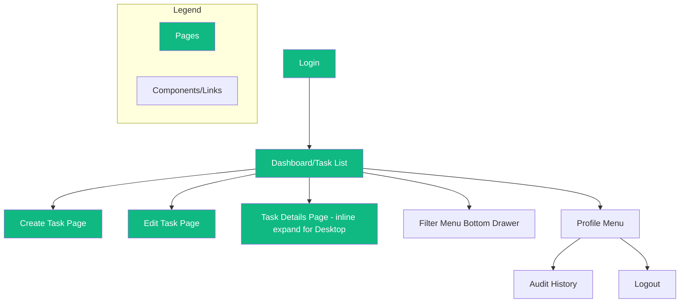

```mermaid
graph TD
    A[Login] --> B[Dashboard/Task List]
    B --> C[Create Task Page]
    B --> D[Edit Task Page]
    B --> E[Task Details Page - inline expand for Desktop]
    B --> F[Filter Menu Bottom Drawer]
    B --> G[Profile Menu]
    G --> I[Audit History]
    G --> J[Logout]
    
    %% Define reusable style class
    classDef primaryNode fill:#10B981,color:#fff
    class A,B,C,D,E primaryNode
    
    %% Legend
    subgraph Legend
        LP[Pages]
        LC[Components/Links]
    end
    
    %% Style legend items
    classDef pageStyle fill:#10B981,color:#fff
    classDef componentStyle stroke-width:1px
    class LP pageStyle
    class LC componentStyle
```