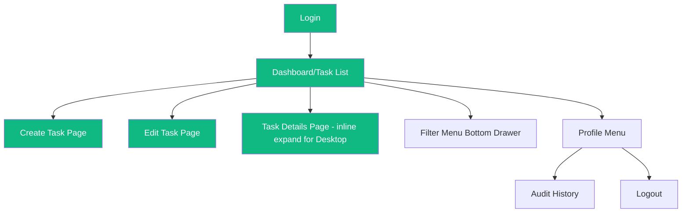
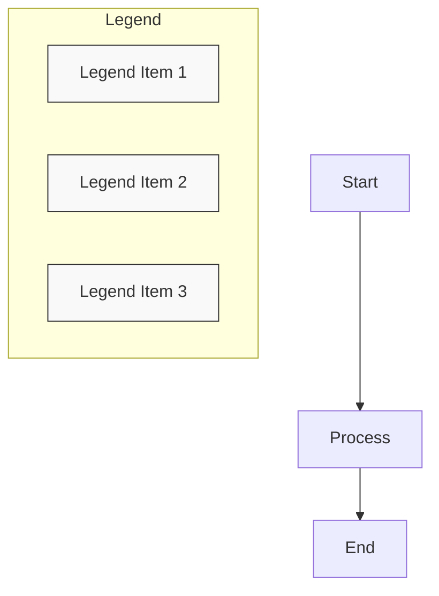

```mermaid
graph TD
    A[Login] --> B[Dashboard/Task List]
    B --> C[Create Task Page]
    B --> D[Edit Task Page]
    B --> E[Task Details Page - inline expand for Desktop]
    B --> F[Filter Menu Bottom Drawer]
    B --> G[Profile Menu]
    G --> I[Audit History]
    G --> J[Logout]
    
    style B fill:#10B981,color:#fff
    style A fill:#10B981,color:#fff
    style C fill:#10B981,color:#fff
    style D fill:#10B981,color:#fff
    style E fill:#10B981,color:#fff
    style E fill:#10B981,color:#fff
```

```mermaid
graph TD
    %% Main diagram content
    A[Start] --> B[Process]
    B --> C[End]
    
    %% Legend using text nodes
    subgraph Legend
        L1[Legend Item 1]
        L2[Legend Item 2]
        L3[Legend Item 3]
    end
    
    %% Style legend items
    classDef legendStyle fill:#f9f9f9,stroke:#333,stroke-width:1px
    class L1,L2,L3 legendStyle
```