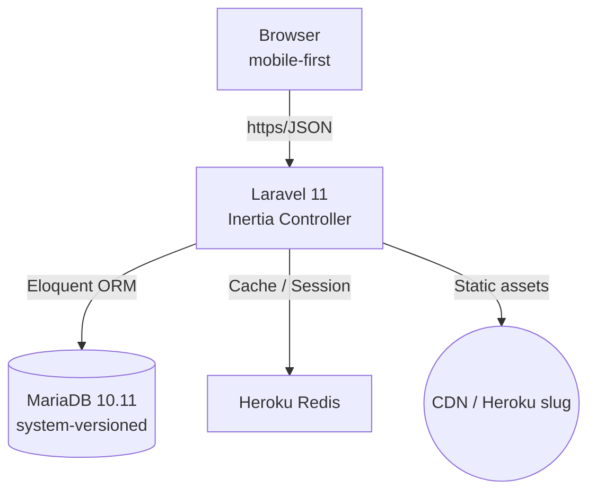

# GovDo Architecture Document

## Introduction

GovDo is a **mobile‑first web application**.  It is delivered as a **Laravel 11 monolith with Inertia + React** inside a **Turborepo** monorepo, deployable to **Heroku**.  The goal of this document is to give developers (human or AI) an unambiguous blueprint for building and evolving GovDo while keeping future extraction into separate services straightforward.

> **Relationship to Front‑End Architecture**\
 Front‑end code lives inside the `apps/web` Laravel app and is composed of reusable React components in `packages/ui`.  This doc covers full‑stack concerns; UI‑specific interaction patterns are detailed in the UI/UX spec.

---

## High‑Level Architecture

### Technical Summary

- **Architecture style:** Monolith with a clear domain/service layer, poised for future service extraction.
- **Rendering:** Server‑side Laravel controllers return Inertia responses; React renders on the client.
- **Persistence:** MariaDB 10.11 with **system‑versioned** `tasks` table for audit‑trail; row‑level `modified_by` column.
- **Hosting:** Heroku container runtime (Hobby dyno) + JawsDB MariaDB add‑on; Redis add‑on for cache/session.
- **CI/CD:** GitHub Actions → Heroku container registry; post‑deploy migration.

### High‑Level Diagram (Mermaid)



### Architectural & Design Patterns

| Pattern                            | Rationale                                                                                                                                    |
| ---------------------------------- | -------------------------------------------------------------------------------------------------------------------------------------------- |
| **Repository Pattern**             | Business logic aggregated per aggregate root; aligns with new Coding‑Standards rule allowing direct model methods for single‑record actions. |
| **System Versioned Table (Audit)** | Built‑in MariaDB history without additional triggers; satisfies tamper‑evident audit trail.                                                  |
| **Server‑Driven UI via Inertia**   | Simplest path for Laravel + React while avoiding REST duplication.                                                                           |
| **Monorepo (Turborepo)**           | Single codebase for shared packages (`packages/ui`) and Laravel app; later service extraction -> new `apps/*`.                               |
| **Twelve‑Factor Config**           | Heroku .env, secret storage, secure cookies, HSTS.                                                                                           |

---

## Tech Stack (Pinned Versions)

| Category          | Technology              | Version    | Purpose                                | Rationale                        |
| ----------------- | ----------------------- | ---------- | -------------------------------------- | -------------------------------- |
| **Language**      | PHP                     | 8.3        | Backend code                           | Latest LTS supporting Laravel 11 |
| **Runtime**       | heroku/php buildpack    | 8.3.22     | Deployed PHP container runtime         | Stable known PHP runtime         |
| **Runtime**       | heroku/nodejs buildpack | 22         | Nodejs runtime Inertia SSR             | Stable known NodeJS runtime      |
| **Framework**     | Laravel                 | 11.x       | Web & API                              | Breeze & Fortify compatibility   |
| **Frontend**      | React                   | 19.x       | UI rendering via Inertia               | Ecosystem & hooks                |
| **Styling**       | Tailwind CSS            | 3.x        | Utility‑first CSS                      | Mobile‑first & industry standard |
| **Build Tool**    | Vite                    | 5.x        | Asset bundling                         | Default in Laravel 11            |
| **Database**      | MariaDB                 | 10.11      | Persistence + auditing                 | Improvements over MySQL          |
| **Cache/Session** | Redis                   | 7.x        | Cache & session store                  | Heroku Redis                     |
| **Testing**       | PestPHP                 | default    | Snapshot, architecture, stress testing | Expressive syntax                |
|                   | PHPUnit                 | default    | Baseline tests                         | Breeze default                   |
| **E2E**           | Laravel Dusk            | default    | Mobile viewport flows                  | Browser‑level tests              |
| **Container**     | Docker + docker‑compose | latest     | Local dev                              | Simulates Heroku setup           |
| **CI/CD**         | GitHub Actions          | n/a        | Build, test, deploy                    | Free & integrated                |

---

## Data Model

### Task

| Field                     | Type                                  | Notes              |
| ------------------------- | ------------------------------------- | ------------------ |
| id                        | BIGINT PK                             | Auto‑increment     |
| title                     | VARCHAR(160)                          | Not null           |
| description               | TEXT                                  | Nullable           |
| priority                  | ENUM('normal','resident','emergency') | Default 'normal'   |
| due\_date                 | DATE                                  | Nullable           |
| modified\_by              | BIGINT                                | FK → users(id)     |
| created\_at / updated\_at | TIMESTAMP                             | Auto               |
| completed_at              | TIMESTAMP                             | Nullable           |
| **system\_time**          | PERIOD FOR SYSTEM\_TIME               | Managed by MariaDB |

> Table defined as `WITH SYSTEM VERSIONING` & partitioned by month for pruning.

---

## Components

| Component                       | Responsibility                                        | Depends On                  |
| ------------------------------- | ----------------------------------------------------- | --------------------------- |
| **TaskController**              | HTTP endpoints for tasks CRUD & list                  | TaskService                 |
| **HistoryController**           | `/tasks/history` audit list                           | AuditService                |
| **TaskService**                 | Business rules, validation                            | TaskRepository              |
| **AuditService**                | Read system‑versioned history                         | DB                          |
| **TaskRepository**              | Aggregate DB ops                                      | Eloquent ORM                |
| **UI Components (packages/ui)** | Reusable React primitives (Button, Modal, FilterChip) | Headless classes + Tailwind |

> **Removed:** `packages/auth` – authentication handled inside Laravel Breeze + Fortify.

---

## REST API Spec (excerpt)

```yaml
openapi: 3.0.0
info:
  title: GovDo API
  version: '1.0'
servers:
  - url: https://govdo.example.com
paths:
  /tasks:
    get:
      summary: List tasks
      parameters:
        - in: query
          name: status
          schema: { type: string, enum: [pending, completed, all] }
      responses:
        '200': { description: OK }
    post:
      summary: Create task
      requestBody:
        required: true
        content:
          application/json:
            schema: { $ref: '#/components/schemas/TaskInput' }
      responses:
        '201': { description: Created }
  /tasks/{id}:
    get: { summary: Get single task, responses: { '200': { description: OK } } }
    put: { summary: Update task, responses: { '200': { description: OK } } }
    delete: { summary: Delete task, responses: { '204': { description: Deleted } } }
  /tasks/history:
    get:
      summary: Global task change history
      responses:
        '200': { description: OK }
components:
  schemas:
    TaskInput:
      type: object
      required: [title]
      properties:
        title: { type: string, maxLength: 160 }
        description: { type: string }
        priority: { type: string, enum: [normal, resident, emergency] }
        due_date: { type: string, format: date }
```

---

## Source Tree (excerpt)

```plaintext
monorepo/
├── apps/
│   └── web/
│       ├── app/Http/Controllers/
│       │   ├── TaskController.php
│       │   └── HistoryController.php
│       ├── app/Services/TaskService.php
│       ├── app/Repositories/TaskRepository.php
│       ├── resources/js/
│       │   ├── Pages/
│       │   └── components/  # feature‑specific, NOT shared
│       └── tests/
│           ├── Feature/
│           └── Browser/     # Dusk tests
├── packages/
│   └── ui/
│       ├── src/Button.tsx
│       ├── src/Modal.tsx
│       └── tailwind.config.cjs
└── resources/
    └── design‑tokens/
```

---

## Error‑Handling Strategy

- **Validation:** Form‑request classes throw 422 JSON with error bag.
- **Auth failures:** 401 (unauthenticated) / 403 (forbidden) via Laravel middleware.
- **Logging:** Laravel Log with Monolog provider to stdout → Heroku papertrail; include `X‑Request‑ID`.

---

## Coding Standards (GovDo‑specific)

1. **Repositories** aggregate business logic & collections of Eloquent models; **calling methods on a single model instance is acceptable** for simple actions.
2. **Reusable React components** live **exclusively** in `packages/ui`; app‑specific components remain inside `apps/web/resources/js/components`.
3. Avoid facades inside services; use constructor DI for testability.
4. Controllers must stay ≤ 150 LOC, delegate to services.
5. All new code passes **Pest snapshot** & **architecture** tests.

---

## Infrastructure & Deployment

- **Heroku**: 1 × Standard‑1 dyno, 1 × JawsDB MariaDB, 1 × Heroku Redis, 1 x Mailgun, 1 x Papertrail
- Heroku with `heroku/php` and `heroku/nodejs` buildpacks; release phase runs `php artisan migrate --force`; 
- Environment vars: `APP_KEY`, `DB_*`, `REDIS_URL`, `REDIS_TLS_VERIFY`, `SESSION_SECURE_COOKIE=true`.
- HSTS header set via TrustProxies middleware (`max‑age=31536000; preload`).

---

## Checklist Results Report

*To be filled by ****architect‑checklist**** (next step).*

